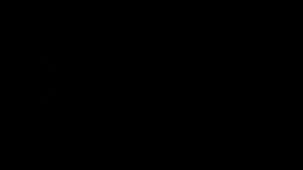

# Infinite Time Horizon Safety of Bayesian Neural Networks

Code repository of the paper *Infinite Time Horizon Safety of Bayesian Neural Networks*, by Lechner, Mathias, Đorđe Žikelić, Krishnendu Chatterjee, and Thomas Henzinger published at NeurIPS 2021 [PDF](https://proceedings.neurips.cc/paper/2021/file/544defa9fddff50c53b71c43e0da72be-Paper.pdf)



## Requirements

```bash
pip3 install -U pip # Upgrade pip
pip3 install -U gym tensorflow mip seaborn gym
```

Tested on Ubuntu 16.04 and Ubuntu 20.04 and Python 3.8.

Running the experiments requires a valid Gurobi license (freely available MIP solvers scale only to the LDS example).

Make sure Gurobi is installed and added to the ```PATH``` and ```LD_LIBRARY_PATH``` environment variables

```bash
export GUROBI_HOME="/xxxxxx/gurobi/903/linux64/"
export PATH="${PATH}:${GUROBI_HOME}/bin"
export LD_LIBRARY_PATH="${LD_LIBRARY_PATH}:${GUROBI_HOME}/lib"

```


## Files

- ```lds_env.py``` Implementation of the LDS environment
- ```pend_env.py``` Implementation of the inverted pendulum environment
- ```car_env.py``` Implementation of the collision avoidance environment
- ```run_mip.py``` Implementation of the verification loop (algorithm 1 in the paper) for the LDS and the inv-pend environment
- ```mixed_integer_encoding.py``` Mixed-integer encoding module for ReLU networks  according to Tjeng et al. (Evaluating Robustness of Neural Networks with Mixed Integer Programming)
- ```run_car_mip.py``` Implementation of the verification loop (algorithm 1 in the paper) for the collision avoidance environment (mostly equivalent to the file ```run_mip.py```)
- ```weights``` Folder containing the pre-trained weights of the policies

## Example usage

```bash
# Runs the verification loop with the LDS environment
python3 run_mip.py --env lds
# Runs the verification loop with the LDS environment and bootstrapping the invariant candidate network
python3 run_mip.py --env lds --bootstrap
# Runs the verification loop with the inv-pend environment with Bayesian weights in all layers
python3 run_mip.py --env pend --first_layer
# Runs the verification loop with the collision avoidance environment
python3 run_car_mip.py --bootstrap
```

## Additional information

The networks with Bayesian weights in the second hidden layer only have a Guassian distribution with a standard deviation of 0.1, while the networks with both layers Bayesian have a standard deviation of 0.05.

Here is an example of how the positive invariant changes during the learner-verifier training procedure:


## Citation

```bib
@inproceedings{lechner2021infinite,
  author    = {Mathias Lechner and Dorde Zikelic and Krishnendu Chatterjee and Thomas A. Henzinger},
  title     = {Infinite Time Horizon Safety of Bayesian Neural Networks},
  booktitle = {In Conference on Neural Information Processing Systems (NeurIPS)},
  year      = {2021}
}
```

